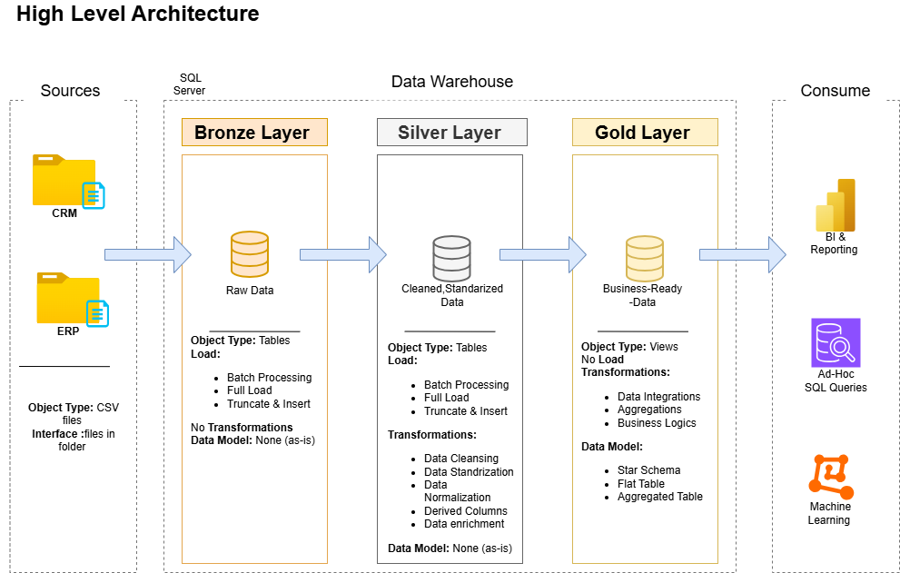
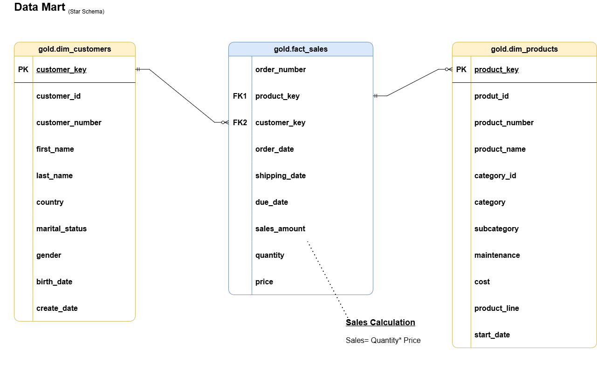

  <h1> SQL Data Warehouse Project</h1>
  

    SQL Server
    Medallion (Bronze → Silver → Gold)
    Star Schema
    Data Engineering
  

  <h2> Project Overview</h2>
  

    This project demonstrates the design and implementation of an <strong>end-to-end SQL Data Warehouse</strong>
    using <strong>SQL Server</strong>, following industry best practices in data engineering.
  

  

    The goal is to build a clean, reliable, and analytics-ready warehouse starting from raw operational data
    (ERP &amp; CRM), applying data quality checks and transformations, and finally exposing business-ready datasets
    using a <strong>Star Schema</strong>.
  

  

    Intended to showcase data engineering fundamentals for internships / apprenticeships in data &amp; analytics.
  

  

  <h2> Architecture Overview</h2>
  
This warehouse follows a <strong>Medallion Architecture</strong>:

  <pre><code>Source Systems → Bronze → Silver → Gold</code></pre>

  <h3> Source Systems</h3>
  <ul>
    <li><strong>CRM</strong>: customer, product, and sales information</li>
    <li><strong>ERP</strong>: customer and location reference data</li>
  </ul>

  <h3> Bronze Layer (Raw)</h3>
  <ul>
    <li>Stores raw data as-is</li>
    <li>No business logic</li>
    <li>Minimal transformations</li>
    <li>Used for traceability and debugging</li>
  </ul>

  <h3> Silver Layer (Cleaned &amp; Standardized)</h3>
  <ul>
    <li>Data cleaning (NULL handling, trimming, standardization)</li>
    <li>Data validation &amp; consistency checks</li>
    <li>Deduplication</li>
    <li>Historical handling (SCD-like logic)</li>
  </ul>

  <h3> Gold Layer (Analytics Ready)</h3>
  <ul>
    <li>Business-oriented tables</li>
    <li><strong>Star Schema</strong></li>
    <li>Optimized for reporting &amp; BI tools</li>
  </ul>

  
<strong> Architecture diagram</strong>

  

  

  <h2> Data Modeling – Gold Layer</h2>
  

    The Gold layer is designed using a <strong>Star Schema</strong>, which is the most common modeling approach
    for analytical workloads.
  

  <h3> Star Schema Design</h3>
  <ul>
    <li><strong>Fact table</strong> at the center (business events)</li>
    <li><strong>Dimension tables</strong> around it (descriptive context)</li>
  </ul>

  
<strong> Star schema diagram</strong>

  

  <h3>Why Star Schema?</h3>
  <ul>
    <li>Simple and intuitive</li>
    <li>Fast query performance</li>
    <li>BI-friendly (Power BI / Tableau / SQL analytics)</li>
    <li>Preserves business facts without data loss</li>
  </ul>

  

  <h2>🔗 Join Strategy (Important Design Choice)</h2>
  

    In the Gold layer, <strong>LEFT JOINs are intentionally used</strong> instead of INNER JOINs.
  

  
<strong>Reason:</strong>

  <ul>
    <li>Fact tables represent real business events (sales, transactions)</li>
    <li>INNER JOIN could <strong>drop valid facts</strong> if a dimension record is missing</li>
    <li>LEFT JOIN ensures <strong>no loss of business data</strong></li>
  </ul>
  

    This is a core best practice in data warehousing.
  

  

  <h2> Data Processing Logic</h2>
  
<strong>Key transformations include:</strong>

  <ul>
    <li><code>TRIM</code>, <code>UPPER</code>, <code>LOWER</code> for text standardization</li>
    <li><code>COALESCE</code> for missing value handling</li>
    <li>Business rule validation (e.g., sales = quantity × price)</li>
    <li>Deduplication using <code>ROW_NUMBER()</code></li>
    <li>Historical tracking using <code>LEAD()</code> for validity periods</li>
  </ul>

  
<strong> Silver layer transformation flow</strong>

  

  

  <h2>🛠️ Technologies Used</h2>
  <ul>
    <li><strong>SQL Server</strong></li>
    <li><strong>SQL Server Management Studio (SSMS)</strong></li>
    <li><strong>T-SQL</strong></li>
    <li>Git &amp; GitHub for version control</li>
  </ul>

  

  <h2> Repository Structure</h2>
  <pre><code>sql_data_warehouse_project/
│
├── bronze/
│   └── load_bronze.sql
│
├── silver/
│   ├── load_silver_customers.sql
│   ├── load_silver_products.sql
│   └── load_silver_sales.sql
│
├── gold/
│   ├── dim_customer.sql
│   ├── dim_product.sql
│   ├── dim_date.sql
│   └── fact_sales.sql
│
├── docs/
│   ├── architecture.png
│   ├── star_schema.png
│   └── silver_layer.png
│
└── README.html
</code></pre>

  

  <h2> Key Skills Demonstrated</h2>
  <ul>
    <li>Data warehouse architecture (Medallion)</li>
    <li>Data modeling (Star Schema)</li>
    <li>SQL transformations &amp; data quality checks</li>
    <li>Handling historical data</li>
    <li>Analytical thinking</li>
    <li>Clean, maintainable SQL code</li>
    <li>Industry-oriented design decisions</li>
  </ul>

  

  <h2> Future Improvements</h2>
  <ul>
    <li>Add orchestration (scheduling / automation)</li>
    <li>Add data quality metrics and logging tables</li>
    <li>Connect a BI tool (Power BI / Tableau / Metabase)</li>
    <li>Automate ingestion pipelines</li>
    <li>Add tests (row counts, constraints, anomaly checks)</li>
  </ul>

  

  <h2> Author</h2>
  

    <strong>Esrae</strong> 
    Engineering student – Data &amp; Software 
    Aspiring Data Engineer / Data Analyst
  

  

    Final note: this project focuses on clarity, correctness, and reasoning (not only execution).
    Design decisions are intentional and aligned with real-world data engineering practices.
  

</body>
</html>

